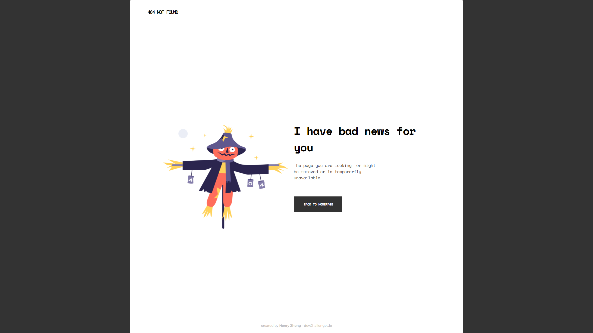

<!-- Please update value in the {}  -->

<h1 align="center">{404-not-found}</h1>

   Solution for a challenge from  <a href="http://devchallenges.io" target="_blank">Devchallenges.io</a>.

  <h3>
    <a href="https://{https://lonelybuddy.github.io/404-not-found/}">
      Demo
    </a>
     | 
    <a href="https://{https://devchallenges.io/solutions/bmAlcVaxOPxV51P9Np5V}">
      Solution
    </a>
     | 
    <a href="https://devchallenges.io/challenges/wBunSb7FPrIepJZAg0sY">
      Challenge
    </a>
  </h3>

<!-- OVERVIEW -->

## Overview

- Where can I see your demo?
  - [Here](https://lonelybuddy.github.io/404-not-found/)
- What was your experience?
  -It was really hard for me to decide the layout of the page, but I managed to -make it happen, very slowly...
- What have you learned/improved?
  -Always go mobile first!
